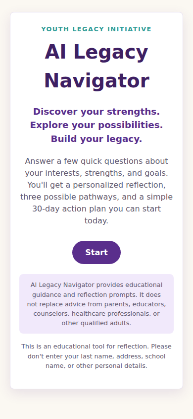
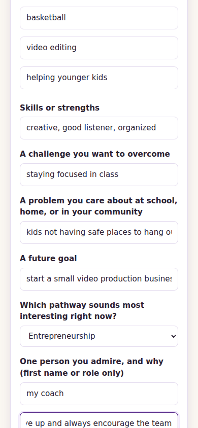
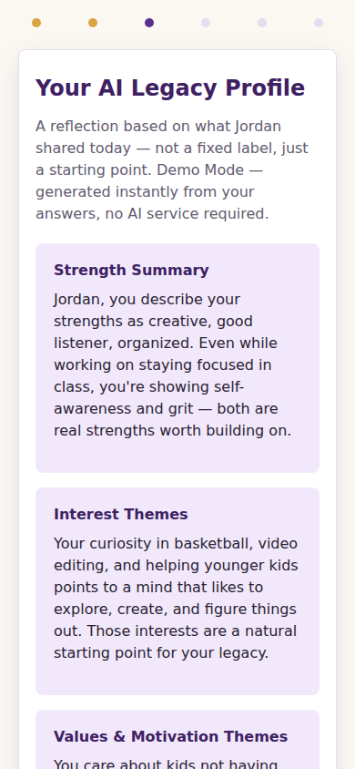
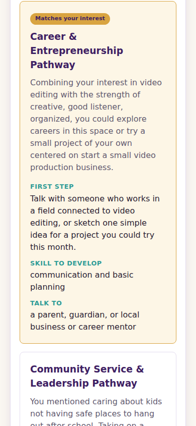
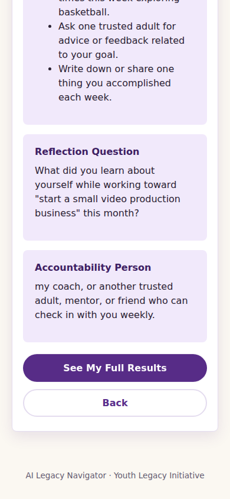
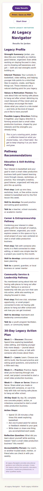

# AI Legacy Navigator

A youth-centered guided planning application from the **Youth Legacy Initiative**.

> Discover Your Strengths. Design Your Future. Build Your Legacy.

## Overview

AI Legacy Navigator helps young people reflect on their strengths, interests, values, and goals,
then turns that reflection into a personalized Legacy Profile, three realistic pathways
(education, career/entrepreneurship, and community service/leadership), and a simple 30-day
action plan. It's built to feel encouraging, age-appropriate, and action-oriented — a starting
point for a conversation, not a verdict.

## Problem

Many youth — especially in grades 6–12 — have real strengths, interests, and ideas about the
future, but no simple, judgment-free way to turn a scattered sense of "what I'm good at" and
"what I care about" into a concrete next step. Generic career quizzes tend to be clinical,
outcome-driven, or aimed at adults.

## Solution

A short, five-minute guided questionnaire generates:

1. An encouraging **Legacy Profile** (strengths, interests, values, and a possible direction)
2. **Three pathway recommendations** with a first step, a skill to build, and who to talk to
3. A **30-day action plan** broken into Discover / Learn / Practice / Share-or-Serve weeks

When `OPENAI_API_KEY` is configured, the protected serverless endpoint generates the result with
**GPT-5.6 Sol**. If the endpoint is unavailable or generation fails, the browser automatically
uses the deterministic **Demo Mode** generator so the core journey remains usable.

## Target Users

**Primary:** Youth in approximately grades 6–12 exploring identity, purpose, education, careers,
entrepreneurship, leadership, and community impact.

**Secondary:** Parents, educators, mentors, and youth-program facilitators supporting them.

## Core Features

- Six-screen guided flow: Welcome → Discovery Questionnaire → Legacy Profile → Pathway
  Recommendations → 30-Day Action Plan → Results
- Brief, easy-to-complete questionnaire (no accounts, no sensitive personal data)
- Legacy Profile: strength summary, interest themes, values/motivation themes, a possible legacy
  direction, and an encouraging personalized statement
- Three pathway cards, each with why it fits, a first step, a skill to develop, and a trusted
  adult/resource category to consult
- 30-day action plan with weekly themes, a measurable goal, three action steps, a reflection
  question, and an accountability person
- Copy-to-clipboard and print-friendly results (print to PDF from the browser's print dialog)
- Live generation with **GPT-5.6 Sol** through the OpenAI Responses API
- Automatic, fully working **Demo Mode** fallback when live generation is not configured or fails

## Responsible-AI & Youth-Safety Considerations

- No mental-health diagnosis or clinical interpretation — the app reflects on strengths and
  interests only, never labels or diagnoses.
- No guaranteed outcomes — all recommendations are framed as possibilities, not promises.
- No collection of surnames, addresses, school names, or phone numbers; the questionnaire only
  asks for a first/preferred name, and the UI explicitly asks users not to enter that information.
- The app encourages users to talk with a parent, guardian, educator, counselor, or mentor about
  major decisions.
- Every results screen displays this disclaimer:
  > AI Legacy Navigator provides educational guidance and reflection prompts. It does not replace
  > advice from parents, educators, counselors, healthcare professionals, or other qualified
  > adults.
- No answers are stored, logged, or sent anywhere unless the optional AI integration is enabled —
  and even then, only the questionnaire answers are sent to OpenAI for that single request; the
  app has no database and persists nothing between sessions.
- Language throughout is supportive and nonjudgmental.

## Technology Stack

- **Frontend:** React 19 + Vite (JavaScript, single-page application)
- **Styling:** Plain CSS with a purple/gold/cream design system, mobile-responsive
- **AI (optional):** `gpt-5.6-sol` through the OpenAI Responses API, called from the protected
  Vercel serverless function in `api/generate.js`; the API key never reaches the browser
- **Storage:** None required — the MVP has no database
- **Deployment:** Any static host that supports a Node/Vercel-style serverless function
  (e.g. Vercel), or the frontend alone on Netlify/any static host in Demo Mode

## Installation

```bash
npm install
```

## Environment Variable Setup

Copy the example file:

```bash
cp .env.example .env
```

`OPENAI_API_KEY` is **optional**. Without it, or if the live request fails, the app falls back to
Demo Mode. To enable GPT-5.6 Sol, set a valid OpenAI API key as a Vercel Project Environment
Variable rather than committing it to `.env`. The key is read only by `api/generate.js`.

## Run Locally

```bash
npm run dev
```

Open the printed local URL (typically `http://localhost:5173`). Vite alone does not serve
`/api/generate`, so this command exercises Demo Mode. To test the serverless endpoint locally,
install the Vercel CLI and run `vercel dev` with `OPENAI_API_KEY` configured.

To build and preview a production bundle:

```bash
npm run build
npm run preview
```

## Demo Instructions

1. Open the app and click **Start**.
2. Fill out the questionnaire with a sample youth profile (first name, grade range, three
   interests, a strength, a challenge, a community concern, a goal, a pathway preference, and one
   admired person).
3. Click **See My Legacy Profile**. A configured deployment uses GPT-5.6 Sol; otherwise, the app
   falls back to Demo Mode and labels that mode on screen.
4. Continue through Pathways and the 30-Day Plan.
5. On the Results screen, try **Copy Results** and **Print / Save as PDF**, then **Start Over**.

## Known Limitations

- Demo Mode generates results from structured templates personalized with the user's own answers.
- Live generation requires a valid OpenAI API key, account access to `gpt-5.6-sol`, and a host that
  serves the Vercel-style function in `api/generate.js`.
- No persistence: refreshing the page or closing the tab clears all answers (by design — nothing
  is saved).
- No accounts, login, or saved history across sessions.
- PDF export relies on the browser's native print-to-PDF rather than a generated PDF file.
- The GPT-5.6 integration has no application-level rate limiting and is intended for demonstration
  use. Run a live smoke test after configuring each deployment environment.

## Future Development Ideas

- Optional parent/mentor summary view
- Saved sessions (with explicit consent and disclosure)
- Additional pathway categories
- Dedicated PDF generation
- Light progress animations
- Additional visual themes

## Founder / Project Attribution

**Sheron Burton**
Youth Legacy Initiative

## Build Week Statement

AI Legacy Navigator was built during Build Week as a Minimum Viable Product: a simple, reliable,
end-to-end experience focused on the core youth journey — reflect, discover pathways, and leave
with a concrete 30-day plan — without unnecessary infrastructure that could put delivery at risk.

## Development Assistance and Verification

OpenAI Codex was used during Build Week to inspect the source and sample PDF, migrate the API route
from `gpt-4o-mini` to `gpt-5.6-sol`, add structured-output validation and fallback safeguards, fix
duplicate week labels and grammar defects, and run the repository's automated checks. Codex is a
development tool used to modify and test the application; user-facing plan generation is performed
by GPT-5.6 Sol only when `OPENAI_API_KEY` is configured, with Demo Mode as the fallback.

Verification commands:

```bash
npm test
npm run lint
npm run build
```

Deployment smoke test: submit one questionnaire on the deployed app and confirm the result is not
labeled Demo Mode. If it is labeled Demo Mode, inspect the `/api/generate` function logs and verify
the environment variable and model access before presenting the live-AI path as working.

## Screenshots

| Welcome | Questionnaire | Legacy Profile |
| --- | --- | --- |
|  |  |  |

| Pathways | 30-Day Plan | Results |
| --- | --- | --- |
|  |  |  |

## License

MIT License — see [LICENSE](LICENSE). © 2026 Stige-63 / Youth Legacy Initiative.
